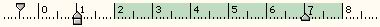



## Righello

### Description

ITA: Questo &#232; l'adattamento di un righello gi&#224; presente in PSCode (ho provato a contattare il suo creatore, senza per&#242; ottenere risposta), con l'aggiunta di alcune caratteristiche quali gli indicatori di margine, la colorazione delle strisce e altre piccole rifiniture. Utile per editor di testi, per esempio.

ENG: This is the adaptation of a MultiRuler already available in PSCode (I've tried to contact its author, without any response), with some added features like margin indicators, stripes colouring and some other little things. Useful for text editors, for instance.
 
### More Info
 

             |
---                |---
**Submitted On**   |2007-01-23 20:43:38
**By**             |[Daniele Binaghi](https://github.com/Planet-Source-Code/PSCIndex/blob/master/ByAuthor/daniele-binaghi.md)
**Level**          |Advanced
**User Rating**    |5.0 (30 globes from 6 users)
**Compatibility**  |VB 5\.0, VB 6\.0
**Category**       |[Custom Controls/ Forms/  Menus](https://github.com/Planet-Source-Code/PSCIndex/blob/master/ByCategory/custom-controls-forms-menus__1-4.md)
**World**          |[Visual Basic](https://github.com/Planet-Source-Code/PSCIndex/blob/master/ByWorld/visual-basic.md)
**Archive File**   |[Righello207379732007\.zip](https://github.com/Planet-Source-Code/daniele-binaghi-righello__1-68929/archive/master.zip)

